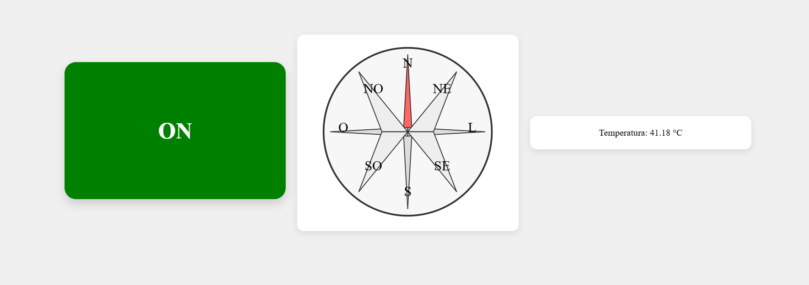

# 🌡️ Painel Interativo com ESP32, Flask e Socket.IO

Este projeto é uma interface web em tempo real que se comunica com um ESP32 para exibir temperatura, estado de botão (ON/OFF) e direção em uma rosa dos ventos. A comunicação é feita via Flask + Socket.IO.

## 🚀 Funcionalidades

- 📶 Comunicação em tempo real com ESP32 via Socket.IO.
- 🌡️ Exibição da temperatura ambiente lida pelo sensor conectado ao ESP32.
- 🔘 Indicação visual do botão pressionado no ESP32 (ON/OFF).
- 🧭 Rosa dos ventos interativa que mostra a direção enviada pelo ESP32.
- 🖱️ Clique direto na bússola para simular direções (modo teste).

---
## 🛠️ Tecnologias Utilizadas

### Backend
- [Python 3](https://www.python.org/)
- [Flask](https://flask.palletsprojects.com/)
- [Flask-SocketIO](https://flask-socketio.readthedocs.io/)

### Frontend
- HTML5, CSS3 e JavaScript Vanilla
- [Socket.IO JS Client](https://socket.io/docs/v4/client-api/)

### Hardware
- [ESP32](https://www.espressif.com/en/products/socs/esp32)
- Sensor de Temperatura (ex: DHT22, LM35, etc.)
- Botão físico para controle ON/OFF

---

## 📁 Estrutura do Projeto

```text
Servidor_Flask/
├── static/
│   ├── main.js        # Código JS que interage com Socket.IO
│   └── style.css      # Estilos da interface
├── templates/
│   └── index.html     # Interface HTML com a bússola e os dados
├── app.py             # Servidor Flask com rotas e WebSocket
├── README.md          # Documentação do projeto
└── requirements.txt   # Dependências Python
```

## ⚙️ Como Executar

### Clonar o Repositório

O primeiro passo consiste em clonar o repositório do residente. No terminal do VsCode digite:

```bash
git clone https://github.com/ResidenciaEmbarcaTech/Servidor_Flask.git
```


### Criar um ambiente virtual Python

Após clonar o repositório, abra o CMD, entre na pasta na qual o repositório foi clonado e crie um ambiente virtual Python, a fim de instalar as dependências e utilizar o servidor Flask.

#### Entre na pasta

```bash
cd <nome_da_sua_pasta>
```

#### Inicialize o ambiente virtual
```bash
Python -m venv venv
```

#### Ative o ambiente virtual
```bash
venv\Scripts\activate
```

#### Instale as dependências
```
pip install -m requirements.txt
```

#### Desative o ambiente virtual
```bash
deactivate
```


Com isso, seu servidor Flask estará pronto para ser programado e utilizado.

### Executar o Servidor

#### Entre na pasta `web`
```bash
cd web
```

#### Execute o servidor Flask
```bash
py server.py
```

---
## Tela HTML


---

## 🔌 Comunicação com ESP32

O ESP32 deve enviar dados via HTTP ou WebSocket conforme os seguintes eventos:

- **POST /TEMP** → envia `{ "value": <temperatura> }`
- **POST /CMD** → envia `{ "action": "click" | "solto" }`
- **POST /DIRECAO** → envia `{ "valor": "Norte" | "Sul" | etc. }`

---

## 👩‍💻 Autor(a)

Larissa Souza  
@LarissaNa


